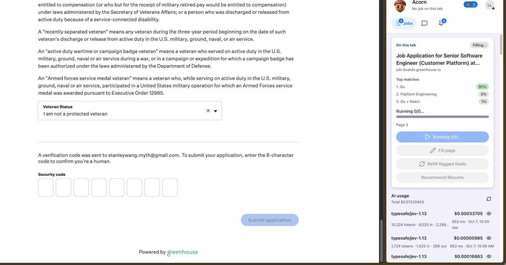
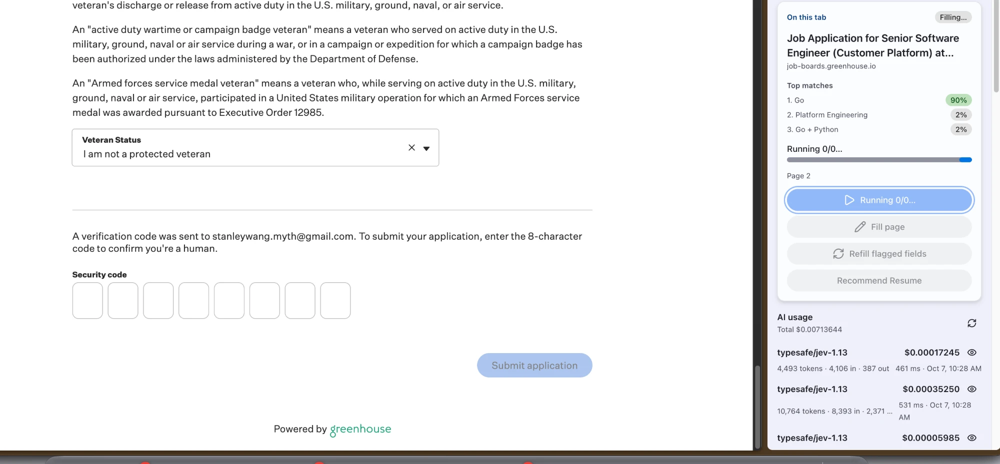
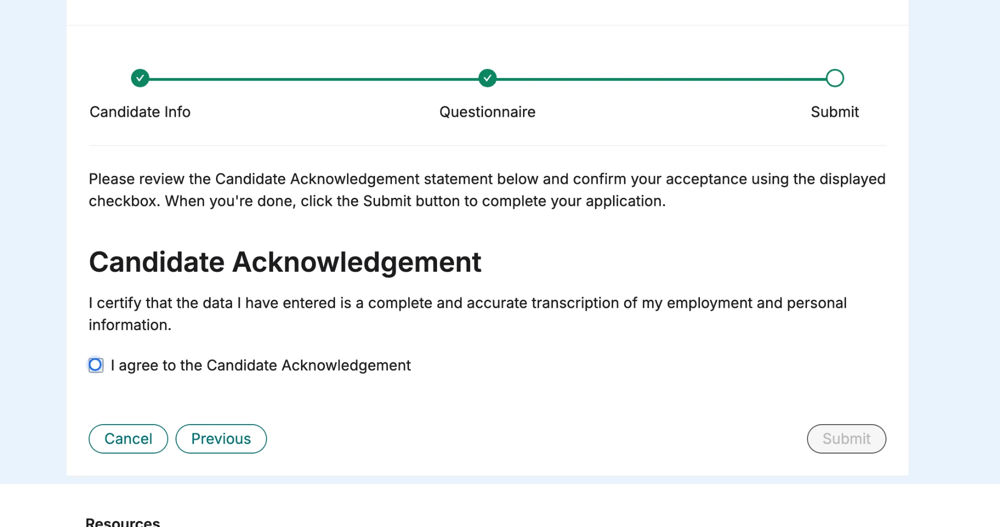
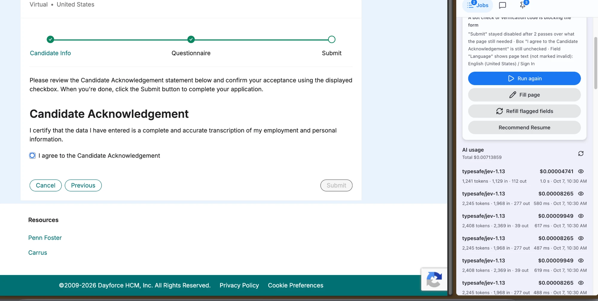
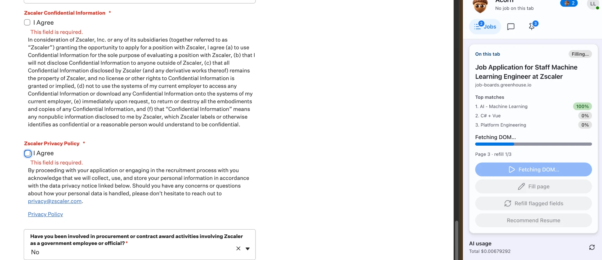
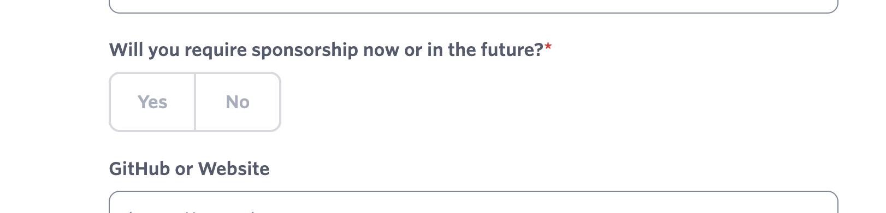

# Run issues — 2026-10-07: model-call loops, security-code steps, and choices that don't stick

Status: **open**. These notes are for planning the fix after a local debug run.

Code references are to `main` at `0f9fbfb` (PR #11, extension v1.24.0). Paths are under
`acorn/extension/src/` unless they start with `acorn-backend/`.

How to read this document:

- **Fact** — seen in the screenshots or logs, or reproduced.
- **Hypothesis** — inferred from the code, still to be confirmed with the debug run
  (see [What to collect](#what-to-collect-from-the-local-debug-run)).

---

## 1. Greenhouse: model calls several times a second on the security-code step

| Code step, Submit disabled                                                  | The run during the loop                                                 |
| --------------------------------------------------------------------------- | ----------------------------------------------------------------------- |
|  |  |

### Symptom

- **What the page wants:** after the questions, Greenhouse emails an 8-character code
  ("enter the 8-character code to confirm you're a human"). **Submit application**
  stays disabled until the code is entered.
- **What the run did:** the sidebar sits on **"Page 2 · Running 0/0…"** while the AI
  usage list grows by 3–4 calls a second (`typesafe/jev-1.13`). An earlier run showed
  the same burst pattern with `openai/gpt-6-luna`.

### Facts

- **"Running 0/0…" means a pass with no plan steps.** It comes from
  `pipeline/run-pipeline.ts:367` (`Running ${idx}/${total}`) with `total = 0`. That
  happens in one of two places:
  - a **pending-only pass**, which starts from an empty plan
    (`run-pipeline.ts:268`, `analyze = pendingOnly ? … emptyPlan()`). The run starts one
    whenever the forward control refuses a click because it is disabled
    (`pipeline/run-orchestrator.ts:757–771`);
  - a fill whose plan came back with no actions.
- **The model calls a step-less pass can still make:**
  - the late-fields pass (`run-pipeline.ts:405`, `planLateFields` → `FastPlan`), which
    classifies the pending fields with Jev and may write answers with the text model;
  - the leftover-dropdown pass (`run-pipeline.ts:431`, `FILL_LEFTOVER_COMBOS` →
    `content/agents/leftover-combobox.ts:60`), which makes one decision per dropdown it
    finds empty.
- **The code boxes are fields the run sees as unanswered.** They are 8 required text
  boxes. Unless the field is classified `person_only` (`acorn-backend/acorn/facts.go:32`),
  a required field the profile cannot answer goes to the writer.

### Hypotheses (most likely first)

1. **The deployed backend predates `needsPerson` / `person_only`.**
   - The run should wait, making no model calls, when the page needs you
     (`run-orchestrator.ts:641` and `:723` → `awaitPerson` at `:408`). That needs the
     backend's read-page answer `needsPerson` (`acorn-backend/selector/advance.go:47`,
     `:223`).
   - From an older backend the field is missing, so the run treats the page as an
     ordinary form. It fills the code boxes or clicks the disabled Submit and starts
     pending-only passes.
   - **Check:** the `read-page` request in the backend log has a `waits_for_person`
     question and the response a `needsPerson` field.
2. **The AI budget never trips without socket pushes.**
   - `RUN_MAX_AI_CALLS` (`pipeline/run-limits.ts:18`) counts calls from the tab's usage
     ledger (`background/tab-usage-store.ts:93`, `usageSince`).
   - That ledger only grows from the server's `ai-usage:recorded` socket push. With an
     older backend (no push) or a dropped socket, the count stays 0 and the cap never
     stops anything.
   - This is also why a fixed cap is the wrong tool (see
     [§4](#4-detecting-these-cases-without-hardcoding)).
3. **The step keeps being judged "new".**
   - `isNewStep` (`pipeline/run-step.ts`, used at `run-orchestrator.ts:553`) starts a
     fresh page state, with fresh refill, blocked-pass and fill limits, whenever a click
     settles as `changed`.
   - A page that re-renders its fields when Submit is pressed would restart the cycle on
     every click.
   - **Check:** the run log event `page` repeating with the same URL and a growing page
     number.
4. **Leftover dropdowns re-decided on every pass.** Less likely: combobox values are
   read from the widget's visible text (`content/agents/read-control-value.ts:23–44`).
   **Check:** `leftover:candidates` events listing dropdowns that already show a value.

---

## 2. Dayforce: the acknowledgement checkbox never gets checked

| The box (blue = highlighted by a step, not checked)           | Run stopped after two passes                                       |
| ------------------------------------------------------------- | ------------------------------------------------------------------ |
|  |  |

### Facts

- **The markup** is Ant Design: a native `<input type="checkbox">` with `opacity: 0`
  inside `<label class="ant-checkbox-wrapper">`. It has no `required`, no `name`, and no
  `aria-*`. Submit is `<button disabled>` until the box is checked.
- **The run's stop**, from the diagnose payload:

  ```text
  "Submit" stayed disabled after 2 passes over what the page still needed
  Box "I agree to the Candidate Acknowledgement" is still unchecked
  Field "Language" shows page text (not marked invalid): English (United States) / Sign In
  Embedded frame: "reCAPTCHA" …
  ```

  The diagnosis picked `bot_check`. The real blocker is the unchecked box; the
  reCAPTCHA is invisible v3.

- **The read-page payload** lists the disabled Submit as `control_13 … DISABLED`, and the
  page-kind / control questions are the current ones. So that backend does have the
  `account_step` change. Whether it also has the later `blocking` change is unknown.
- **The same pair of requests repeats with identical token counts.** The usage list
  shows 2,245 tokens (1,968 in / 277 out) and 2,408 tokens (2,369 in / 39 out), each
  three or more times within about a second. Same request, same page, nothing new between
  them.
- **The click itself works.** The exact DOM above, loaded in Chromium with the real
  bundled content code (`selectRadioElement`, intent `true`), ends with
  `checked === true`. The field scan reports it as `toggle`, label "I agree to the
  Candidate Acknowledgement", `required: false`.

### Hypotheses

1. **The decision answers "Leave this box unchecked".**
   - The box isn't marked required, so the first fill's choice question has no reason to
     check it.
   - On the disabled-Submit passes the box is asked about again with
     `blocking: true`. The extension sets it (`content/pending-fields.ts:52`), and the
     backend turns it into `blockingNote` in the question (`acorn-backend/acorn/fastplan.go:410`).
   - A backend without that change drops the flag, and the same "leave" answer comes
     back each pass. That fits the identical repeated requests.
2. **The step was planned "check" but failed and wasn't reported.**
   - Since v1.24.0 a click that doesn't hold throws "The page did not keep the box
     checked" (`content/agents/select-radio.ts:239`).
   - A failed step on a pending-only pass is not carried into the stop's evidence, which
     lists only flagged fields and the passes.
   - **Check:** `step:error` for that element.

---

## 3. Zscaler (Greenhouse) and Ashby: a second click un-chooses the answer

| Zscaler: two "I Agree" boxes                          | Ashby: Yes/No buttons, selection shown only by style |
| ----------------------------------------------------- | ---------------------------------------------------- |
|  |      |

### Facts and the v1.24.0 change

- **Before v1.24.0:**
  - **Wrong element read:** state was read from the element being clicked. A `<label>`
    or a styled button carries no state, so it always read "not chosen" and was clicked
    again.
  - **Wrong box found:** an "I Agree" step could match the other "I Agree" box inside a
    wide container.
- **v1.24.0** reads state where it lives (`content/agents/choice-state.ts:43`,
  `readableState`):
  - the control's own native or ARIA state;
  - the control a `<label>` names;
  - an input inside the option;
  - for unreadable buttons the run clicked itself, a change from how they looked before
    that click (`:34`, `rememberLookBeforeClick`; `:64`, `choiceState`).
- **Every option click goes through `activateUnlessChosen`**
  (`content/agents/select-radio.ts:176`).
- **Native boxes are scoped to their own field wrapper** (`groupRoot`, `:121`).
- **Checked on fixture copies:** two "I Agree" boxes (one pre-checked) both end checked;
  a style-only "No" stays selected after two passes.

### Open risk

The "looks different than before our click" rule can be fooled by focus or hover styling.
A focus ring that changes the border colour would read as "chosen" even if the click
didn't take.

---

## 4. Detecting these cases without hardcoding

A fixed cap (`RUN_MAX_AI_CALLS`, `RUN_MAX_FILLS_PER_PAGE`) stops a loop after the money
is spent and says nothing about why. What the three cases share is **work that changes
nothing**. The signals below detect that directly, using only the run's own state and
standard HTML.

### a. No-progress detection (replaces the caps)

- **Fingerprint each loop iteration** after its action:
  - step address (host and path);
  - the field set (`pageSignature`);
  - the count of answered fields and their values' hash (never sent anywhere);
  - the flagged-field set;
  - whether the forward control is enabled.
- **An iteration whose fingerprint was already seen on this step made no progress.**
  Stop right there with evidence: "the last pass changed nothing on the page", plus
  what is still blank.
- **The rule works on every site.** A loop of any kind repeats a state, whatever the
  page or platform.

### b. Repeated-request detection (the "3–4 identical calls a second")

- **Hash every model request** (purpose plus its inputs) in the service worker, per tab.
- **The same hash again while the page fingerprint is unchanged is a loop:**
  - reuse the earlier answer (no new call);
  - count the repeat as "no progress" for (a).
- **Dayforce already shows it:** the identical 1,968-in and 2,369-in requests.

### c. Steps only the applicant can do (security codes, challenges)

- **The page-read decision says so:** `needsPerson`, a meaning-based question that names
  no site.
- **Standard HTML says so too** (the spec, not any site):
  - `autocomplete="one-time-code"`;
  - `inputmode="numeric"`;
  - a run of adjacent single-character inputs (`maxlength="1"`) sharing one label.
- **Such fields are never filled.** The run waits on the cheap page probe
  (`waitForPerson`, no model calls) and goes on once the page moves.

### d. Choices that must stick

- **After every option click, re-read the state where it lives.** If it didn't change,
  record a failed step with evidence (label, before and after state).
- **Carry failed steps from every pass into the stop's evidence,** not only the flagged
  fields.
- **When the forward control stays disabled and the only blank items are boxes, say so
  plainly** (Dayforce): "Submit stays disabled; these boxes are unchecked: …".

---

## What to collect from the local debug run

Run a dev build with `VITE_ACORN_DEBUG=true` and a backend with `ACORN_DEBUG_DIR` set
(see `acorn/README.md`). Then, per site:

| Where                                      | What to look for                                                                                                                                    |
| ------------------------------------------ | --------------------------------------------------------------------------------------------------------------------------------------------------- |
| `acorn-backend/debug-runs/<run>/plan.json` | Is there a step for the checkbox or code boxes? With what `value`?                                                                                  |
| `…/steps.ndjson`                           | `step:start`, `step:already-check`, `step:acted`, `step:error` for that element; `leftover:candidates` / `leftover:filled`; `drift:repair`          |
| `…/form-fields.json`                       | Each field's `kind`, `label`, `required`, `blocking`                                                                                                |
| `…/ai-*.md`                                | The choice decision for the box ("Check this box" vs "Leave this box unchecked") and whether the question includes the blocking note                |
| backend log `acorn run event`              | `page` (does the page number climb on the same URL?), `after-click`, `blocked`, `fill:done` with `phases`, `wait:person`, `budget:spent`, `settled` |
| backend log `read-page`                    | Does the request ask `waits_for_person`, and does the response carry `needsPerson`? (if not, the backend is older than the extension)               |
